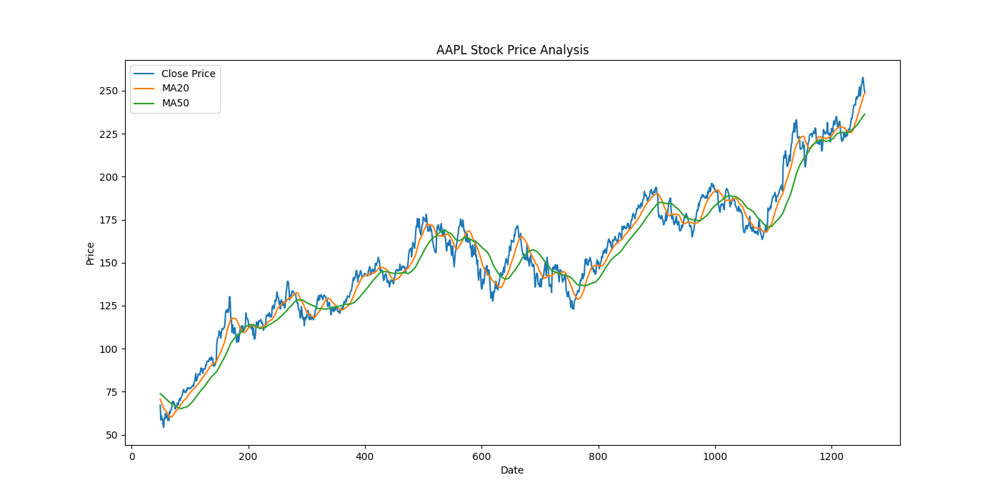
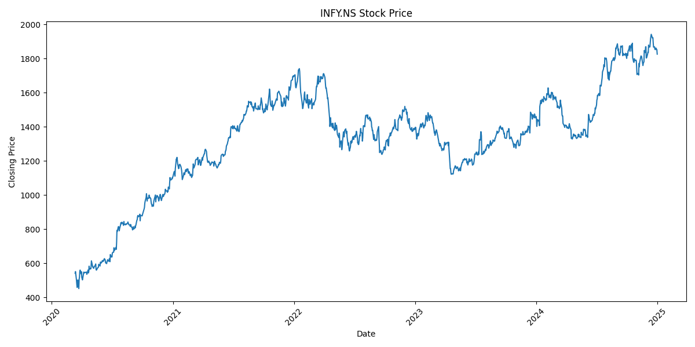
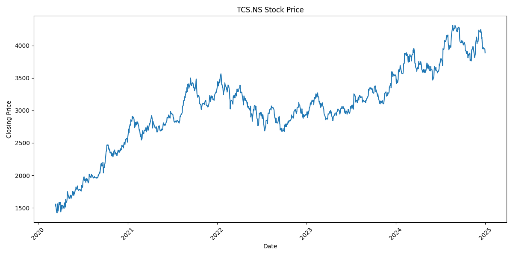
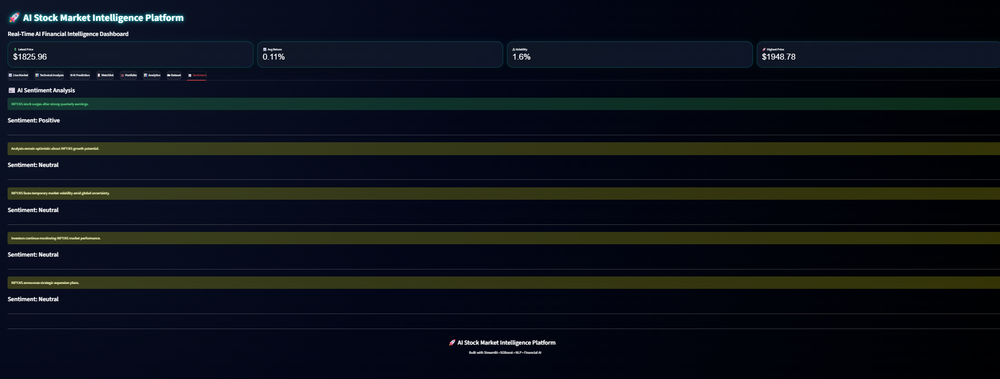

# 🚀📈 AI Stock Market Intelligence Platform

<p align="center">


</p>

---

# 🌌 Overview

> 🌍 Transforming raw stock market data into intelligent financial insights using Artificial Intelligence, Machine Learning, Technical Analysis, and Interactive Analytics.

Most stock dashboards simply display charts and numbers.

I wanted to build something more intelligent.

So instead of creating just another “stock app,” I developed an:

# 🤖 AI Stock Market Intelligence Platform

A modern AI-powered financial analytics system designed to:

✅ Analyze market trends  
✅ Visualize stock movement  
✅ Generate AI-driven insights  
✅ Perform technical analysis  
✅ Simulate fintech-grade analytics dashboards  
✅ Deliver interactive financial intelligence  

This project combines:

🧠 Artificial Intelligence  
💹 Financial Analytics  
📊 Machine Learning  
📈 Technical Indicators  
🌌 Interactive Dashboards  
⚡ Real-Time Data Processing  
💼 Portfolio Analytics  
📰 NLP-Based Sentiment Analysis  

into one unified intelligent platform.

---

# 🎯 Project Vision

The goal was to build a dashboard inspired by:

📊 Bloomberg Terminal  
💹 TradingView  
🚀 Modern Fintech SaaS Platforms  
🤖 AI Analytics Systems  

instead of building a simple beginner project.

This platform focuses on:

✨ Real-world usability  
✨ Interactive analytics  
✨ AI-based prediction  
✨ Modern UI/UX  
✨ Financial intelligence  
✨ Professional dashboard engineering  

---

# ⚡ Core Features

# 📈 Real-Time Market Analytics

Track stock market behavior in real time with:

✅ Multi-stock comparison  
✅ Live market visualization  
✅ Interactive financial charts  
✅ Dynamic stock trend analysis  
✅ Real-time dashboard refresh  
✅ Responsive market monitoring  

---

# 📊 Advanced Technical Analysis

Built-in financial indicators include:

📌 SMA (Simple Moving Average)  
📌 EMA (Exponential Moving Average)  
📌 RSI (Relative Strength Index)  
📌 MACD  
📌 MACD Signal  
📌 Bollinger Bands  
📌 Momentum Analysis  
📌 Volatility Tracking  
📌 Trend Strength Detection  

These indicators simulate real trading analytics systems used in professional financial platforms.

---

# 🤖 AI Prediction Engine

The platform uses Machine Learning to predict market trends.

Built using:

🧠 XGBoost Classifier  
🧠 Feature Engineering  
🧠 Historical Pattern Analysis  
🧠 Technical Indicators  

The AI system predicts:

📈 Uptrend  
📉 Downtrend  
🟢 Buy Signal  
🔴 Sell Signal  
🟡 Hold Signal  

---

# 💼 Smart Portfolio Tracker

Interactive portfolio management system featuring:

✅ Investment tracking  
✅ Quantity management  
✅ Buy price management  
✅ Portfolio valuation  
✅ Profit/Loss analysis  
✅ Return percentage analytics  
✅ Investment summaries  

---

# 📊 Interactive Analytics Dashboard

Powerful financial visualization system including:

🥧 Portfolio Allocation Pie Chart  
📊 Profit/Loss Bar Charts  
📈 Return Distribution Charts  
💹 Multi-Stock Comparison Graphs  
📉 Trend Analytics  
📌 Financial KPI Cards  

Built with:
- Plotly
- Interactive visualization
- Fintech-inspired UI design

---

# 📰 AI Sentiment Analysis

Natural Language Processing-based sentiment engine:

✅ Positive sentiment detection  
✅ Negative sentiment detection  
✅ Neutral sentiment analysis  
✅ Financial news processing  

Powered using:
- TextBlob
- NLP techniques

---

# 🎨 Premium Fintech UI/UX

The dashboard was designed with a modern fintech-inspired appearance.

✨ Features include:

🌌 Glassmorphism Effects  
💎 Neon Glow UI  
⚡ 3D Dashboard Cards  
🌈 Gradient Highlights  
📱 Responsive Layout  
🎯 Smooth Hover Animations  
🌙 Premium Dark Theme  
📊 Professional Analytics Styling  

Inspired by:
- TradingView
- Bloomberg
- Modern AI SaaS dashboards

---

# 🛠️ Tech Stack

<p align="center">


</p>

## 💻 Frontend
- Streamlit
- Plotly
- HTML/CSS

---

## ⚙️ Backend
- Python

---

## 🧠 Machine Learning
- XGBoost
- Scikit-learn

---

## 📊 Data Processing
- Pandas
- NumPy

---

## 🌍 Financial Data
- Yahoo Finance API (yfinance)

---

## 📰 NLP
- TextBlob

---

# 📂 Project Structure

```bash
AI-Stock-Market-Intelligence-Platform/
│
├── app/
│   └── streamlit_app.py
│
├── src/
│   ├── data_loader.py
│   ├── preprocessing.py
│   ├── prediction.py
│   ├── indicators.py
│   ├── sentiment.py
│   ├── portfolio.py
│   └── visualization.py
│
├── data/
├── charts/
├── models/
├── outputs/
├── reports/
│
├── main.py
├── requirements.txt
└── README.md
```

---

# ⚡ Installation Guide

# 1️⃣ Clone Repository

```bash
git clone https://github.com/sujalkrshaw/AI-Stock-Market-Intelligence-Platform.git
```

---

# 2️⃣ Open Project Folder

```bash
cd AI-Stock-Market-Intelligence-Platform
```

---

# 3️⃣ Create Virtual Environment

## Windows

```bash
python -m venv venv
```

Activate environment:

```bash
venv\Scripts\activate
```

---

# 4️⃣ Install Dependencies

```bash
pip install -r requirements.txt
```

---

# 🚀 Run The Project

# 🧠 Train AI Model

```bash
python main.py
```

---

# 🌌 Launch Dashboard

```bash
streamlit run app/streamlit_app.py
```

---

# 📊 Dashboard Modules

| Module | Purpose |
|---|---|
| 📈 Live Market | Real-time stock analytics |
| 📊 Technical Analysis | Financial indicators |
| 🤖 AI Prediction | ML-based forecasting |
| 📋 Watchlist | Multi-stock tracking |
| 💼 Portfolio | Investment management |
| 📊 Analytics | Pie/bar chart analytics |
| 🗂 Dataset | Download stock datasets |
| 📰 Sentiment | NLP-based analysis |

---

# 📈 Machine Learning Workflow

# 🔄 AI Pipeline

The system follows this workflow:

1️⃣ Fetch stock market data  
2️⃣ Clean & preprocess data  
3️⃣ Generate technical indicators  
4️⃣ Perform feature engineering  
5️⃣ Train AI prediction model  
6️⃣ Predict market movement  
7️⃣ Generate trading signals  
8️⃣ Visualize analytics interactively  

---

# 🧠 Features Used For Prediction

The AI model uses:

✅ Daily Return  
✅ Volatility  
✅ MA20  
✅ MA50  
✅ EMA20  
✅ RSI  
✅ MACD  
✅ MACD Signal  
✅ Bollinger Bands  
✅ Momentum  
✅ Trend Strength  

---

# 📊 AI Model Evaluation

Performance measured using:

✅ Accuracy  
✅ Precision  
✅ Recall  
✅ F1 Score  
✅ ROC-AUC Score  

---

# 🎯 Real-World Applications

This platform can be used for:

💹 Financial Analytics  
📈 Investment Monitoring  
🤖 AI Trading Research  
📊 Technical Analysis Learning  
💼 Portfolio Management  
🧠 Data Science Practice  
🚀 Fintech Dashboard Development  

---

# 🔮 Future Improvements

Planned upgrades:

🚀 LSTM Deep Learning Forecasting  
🚀 Real News API Integration  
🚀 FastAPI Backend Expansion  
🚀 Next.js Frontend  
🚀 Authentication System  
🚀 PostgreSQL Database  
🚀 Docker Deployment  
🚀 Cloud Hosting  
🚀 WebSocket Real-Time Streaming  
🚀 Mobile Optimization  
🚀 AI Chatbot Assistant  

---

# 📸 Dashboard Preview

# 🌌 Premium AI Financial Dashboard

# 📸 Project Screenshots

---

## 🎨 Main Dashboard UI

<p align="center">
  
</p>

---

## 🤖 AI Prediction System

<p align="center">
  
</p>

---

## 📊 Technical Analysis Dashboard

<p align="center">
  
</p>

---

## 📈 Live Market Monitoring

<p align="center">
  
</p>

---

## 📉 Portfolio Analysis

<p align="center">
  
</p>

---

## 💼 Portfolio Tracker

<p align="center">
  
</p>

---

## 📌 Watchlist System

<p align="center">
  
</p>

---

## 📊 Model Comparison

<p align="center">
  
</p>

---

## 🎯 Feature Importance Analysis

<p align="center">
  
</p>

---

## 📈 ROC Curve Evaluation

<p align="center">
  
</p>

---

## 📉 Return Distribution Analysis

<p align="center">
  
</p>

---

## 🧠 Confusion Matrix

<p align="center">
  
</p>

---

## 🗂 Dataset Visualization

<p align="center">
  
</p>

---

## 🏗 Project Structure

<p align="center">
  
</p>

---

# 📊 Stock Charts

---

## 🍎 Apple Stock Chart

<p align="center">
  
</p>

---

## 🇮🇳 INFY Stock Chart

<p align="center">
  
</p>

---

## 📈 TCS Stock Chart

<p align="center">
  
</p>

---

## 💬 Sentiment Analysis

<p align="center">
  
</p>

---
---

# 🌍 Deployment Ready

This project can be deployed on:

☁️ Streamlit Cloud  
☁️ Render  
☁️ Railway  
☁️ AWS  
☁️ Azure  
☁️ Google Cloud Platform  

---

# 🧪 Main Requirements

Core libraries used:

- streamlit
- plotly
- pandas
- numpy
- scikit-learn
- xgboost
- yfinance
- textblob

---

# 👨‍💻 Author

# ✨ Suvil Kumar Shaw

🚀 AI & Data Analytics Enthusiast

Passionate about:

🤖 Artificial Intelligence  
📊 Data Science  
💹 Financial Analytics  
🧠 Machine Learning  
📈 Dashboard Engineering  
🚀 Fintech Innovation  

---

# ⭐ Support The Project

If you found this project useful:

⭐ Star the repository  
🍴 Fork the project  
📢 Share with others  

---

# 📜 License

This project was created for:

🎓 Educational purposes  
💼 Portfolio showcase  
📊 Financial analytics learning  
🤖 AI experimentation  

---
